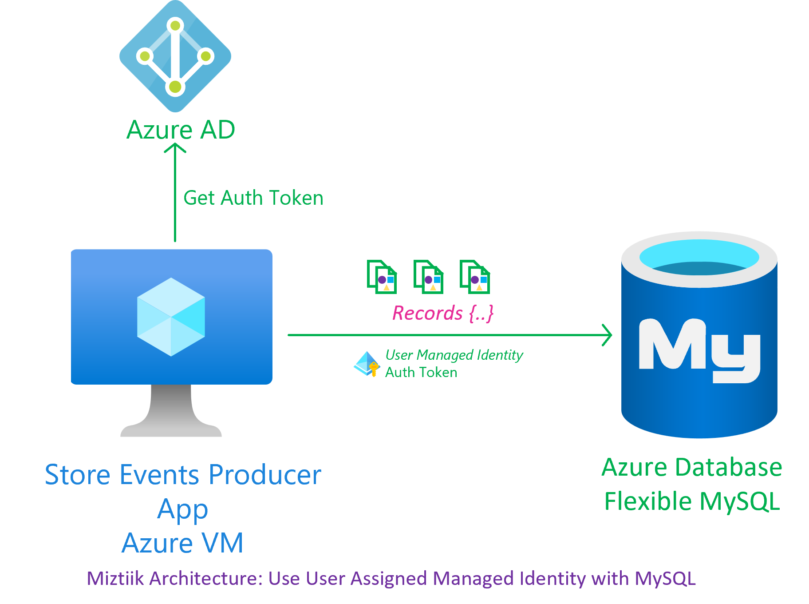
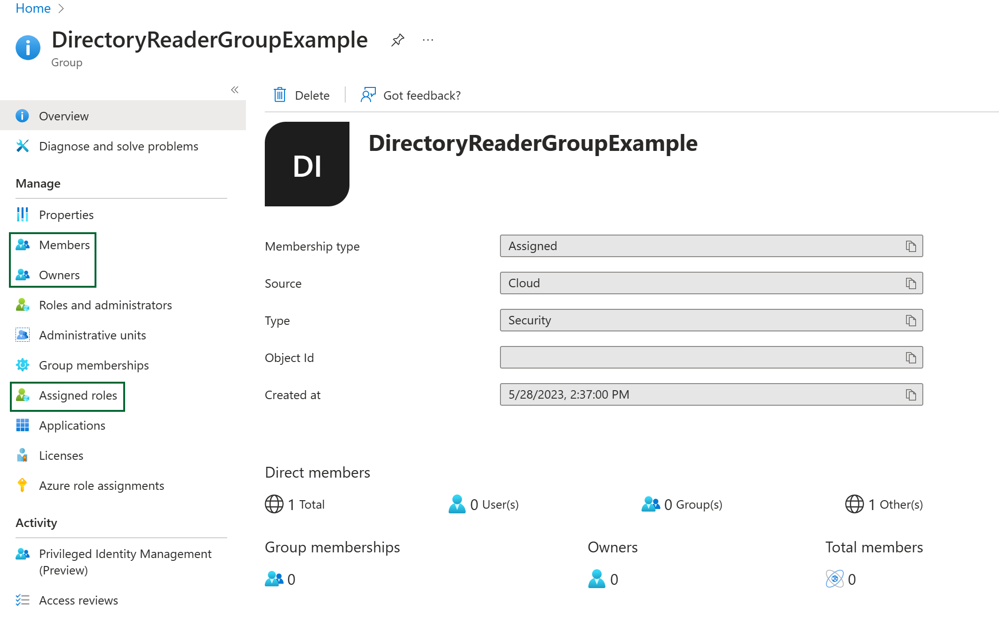
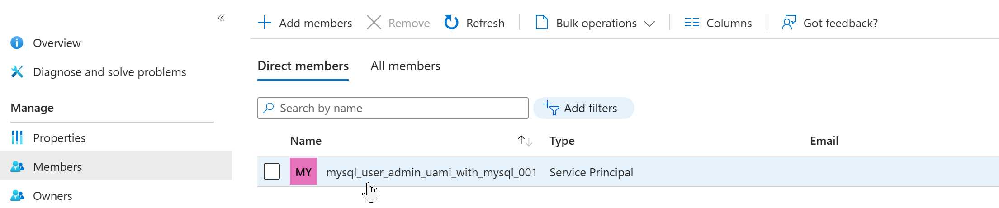
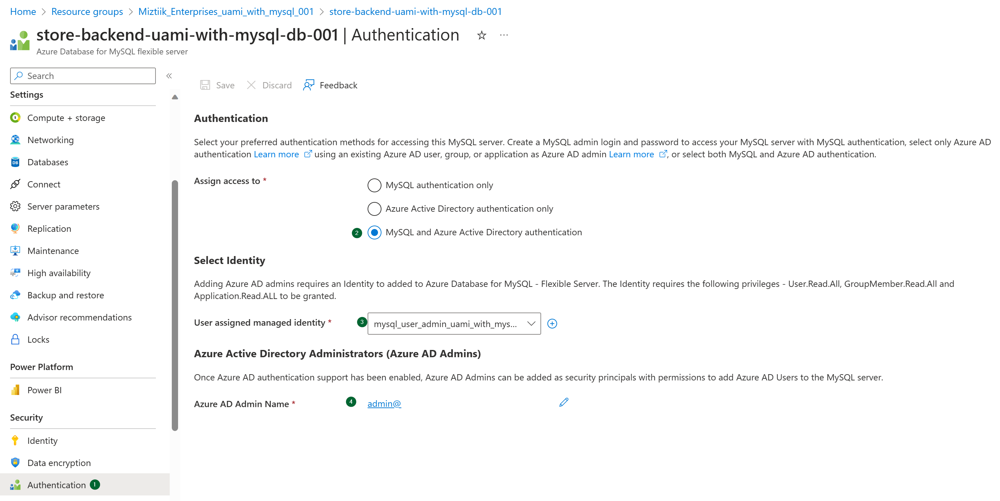
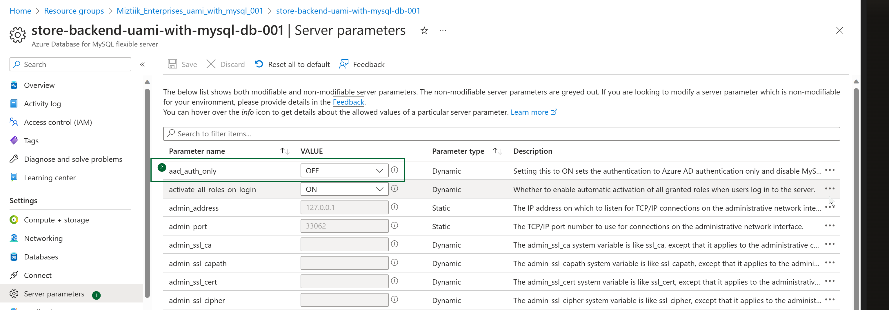
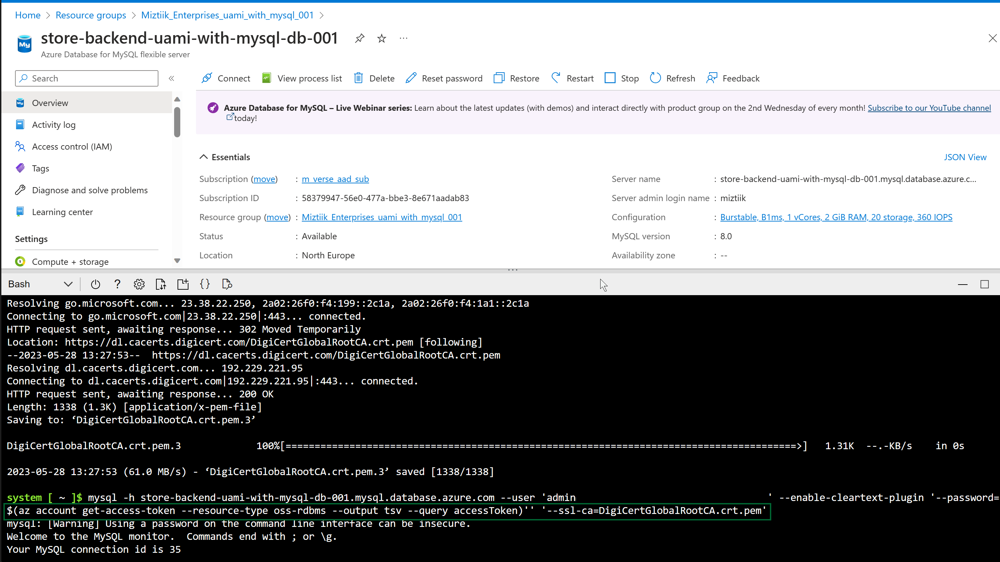
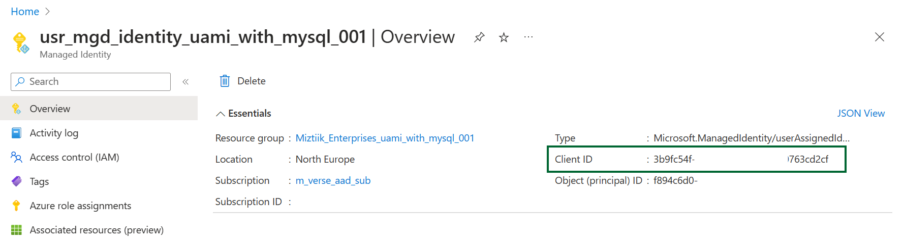

# Connect securely to Azure Database for Flexible MySQL with User Assigned Managed Identity

A simple demonstration to use User Assigned Identity with Azure MySQL for secure authentication

## 🎯 Solution

We will create two identities, one for administring the SQL users(aka control plane) and for interacting with the database and the data(ie. data plane operations)



1. ## 🧰 Prerequisites

   This demo, along with its instructions, scripts, and Bicep template, has been specifically designed to be executed in the `northeurope` region. However, with minimal modifications, you can also try running it in other regions of your choice (the specific steps for doing so are not covered in this context)

   - 🛠 Azure CLI Installed & Configured - [Get help here](https://learn.microsoft.com/en-us/cli/azure/install-azure-cli)
   - 🛠 Azure Function Core Tools - [Get help here](https://learn.microsoft.com/en-us/azure/azure-functions/functions-run-local?tabs=v4%2Cwindows%2Ccsharp%2Cportal%2Cbash#install-the-azure-functions-core-tools)
   - 🛠 Bicep Installed & Configured - [Get help here](https://learn.microsoft.com/en-us/azure/azure-resource-manager/bicep/install)
     - 🛠 [Optional] VS Code & Bicep Extenstions - [Get help here](https://learn.microsoft.com/en-us/azure/azure-resource-manager/bicep/install#vs-code-and-bicep-extension)
   - `jq` - [Get help here](https://stedolan.github.io/jq/download/)
   - `bash` or git bash - [Get help here](https://git-scm.com/downloads)

2. ## ⚙️ Setting up the environment

   - Get the application code

     ```bash
     git clone https://github.com/miztiik/azure-web-server-to-mysql.git
     cd azure-web-server-to-mysql
     ```

3. ## 🚀 Prepare the local environment

   Ensure you have jq, Azure Cli and bicep working

   ```bash
   jq --version
   func --version
   bicep --version
   bash --version
   az account show
   ```

4. ## 🚀 Deploying the Solution

   - **Stack: Main Bicep**
     The params required for the modules are in `params.json`. Modify them as needed. The helper deployment script `deploy.sh` will deploy the `main.bicep` file. This will create the following resoureces
     - Resource Group(RG)
     - VNet, Subnet & Virtual Machine
     - Virtual Machine(Ubuntu) - `1` - Defined in `params.json` named `vmCount`
        - Bootstrapped with custom libs using `userData` script - Installs Nginx
        - Install Azure Monitoring Agent
     - User Managed Identity - Identity attached to the VM with the following permissions,
        - Monitoring Metrics Publisher
     - SQL Admin User Managed Identity - Identity attached to the VM with the following permissions,
        - We will have to add **Directory Reader** privileges manullay to this identity, as it can couldn't be done through bicep
     - Azure Database for MySQL Server - Flexible
        - Admin User
        - Admin Password
        - SQL Version  - `8.0`
        - **Apparently Northeurope doesn't support high availability for Flexible servers as of Q2-2023**

     **Note** - I hacked the template from another repo of mine, so you will see some unused resources(log analytics workspace/queues etc.,). _You can safely ignore them, But do remember to clean up your Resource Group to avoid unnecessary costs._

    ```bash
    # make deploy
    sh deployment_scripts/deploy.sh
    ```

     After successfully deploying the stack, Check the `Resource Groups/Deployments` section for the resources.

5. ## 🔬 Testing the solution

   - Add SQL Admin `Directory Reader` privileges - [Ref this doc][2]
      
      
   - Enable AAD Authetication for Azure MySQL - [Ref this doc][3]
      
      
      

      You will need the client Id of the managed identity
            

      ```sql
      mysql> SET aad_auth_validate_oids_in_tenant = OFF;
      Query OK, 0 rows affected (0.02 sec)

      mysql> CREATE AADUSER 'miztiik_aad_user' IDENTIFIED BY '3b9..d2cf';
      Query OK, 0 rows affected (0.03 sec)
      ```

      Now we are all set, What have we done so far?
      - Created a SQL Admin User Managed Identity - Gave it `Directory Reader` privileges
      - Enabled AAD Authetication for Azure MySQL
      - Created a AAD User `miztiik_aad_user` with the client id of the SQL User Managed Identity(Note: This is not the same as the SQL Admin User Managed Identity). This user will be used to connect to the database from the VM.

   - Login to your VM, You can find the public IP address in the resource blade. You can also get it from the Azure Portal. _You may also try connecting to the database from local machine if you have mysql client, In this case, lets use the Azure VM as it is already bootstrapped with the mysql client_

     ```bash
     ssh miztiik@<PUBLIC_IP_ADDRESS>
     ```


      ```bash
       # Connect to the database
       HOST='store-backend-uami-with-mysql-db-001.mysql.database.azure.com'
       PORT=3306
       USERNAME='miztiik_aad_user'

       # This is the client id of the user managed identity
       # CLIENT_ID='3b9f63..cd2cf'

       # Retrieve the access token
       ACCESS_TOKEN=$(curl -s "http://169.254.169.254/metadata/identity/oauth2/token?api-version=2018-02-01&resource=https%3A%2F%2Fossrdbms-aad.database.windows.net&client_id=$CLIENT_ID" -H Metadata:true | jq -r .access_token)

       # echo $ACCESS_TOKEN

       mysql -h $HOST --user $USERNAME --enable-cleartext-plugin --password=$ACCESS_TOKEN
      ```

      Verify the user details,

      ```sql

      ```sql
      mysql> SELECT USER(), CURRENT_USER();
      +-------------------------------+--------------------+
      | USER()                        | CURRENT_USER()     |
      +-------------------------------+--------------------+
      | miztiik_aad_user@20.238.78.77 | miztiik_aad_user@% |
      +-------------------------------+--------------------+
      1 row in set (0.00 sec)

      mysql>
      ```

6. ## 📒 Conclusion

   In this demonstration, we have shown how to connect to Azure DB for Flexible MySQL using Managed Identities.
  
7. ## 🧹 CleanUp

   If you want to destroy all the resources created by the stack, Execute the below command to delete the stack, or _you can delete the stack from console as well_

   - Resources created during [Deploying The Solution](#-deploying-the-solution)
   - _Any other custom resources, you have created for this demo_

   ```bash
   # Delete from resource group
   az group delete --name Miztiik_Enterprises_xxx --yes
   # Follow any on-screen prompt
   ```

   This is not an exhaustive list, please carry out other necessary steps as maybe applicable to your needs.

## 📌 Who is using this

This repository aims to show how to Bicep to new developers, Solution Architects & Ops Engineers in Azure.

### 💡 Help/Suggestions or 🐛 Bugs

Thank you for your interest in contributing to our project. Whether it is a bug report, new feature, correction, or additional documentation or solutions, we greatly value feedback and contributions from our community. [Start here](/issues)

### 👋 Buy me a coffee

[](https://ko-fi.com/Q5Q41QDGK) Buy me a [coffee ☕][900].

### 📚 References

1. [Azure Docs: Connect with Managed Identity to Azure Database for MySQL][1]
1. [Azure Docs: Assign Directory Readers role to an Azure AD group][2]
1. [Azure Docs: Connect with Managed Identity to Azure Database for MySQL][3]
1. [Azure Docs: Just In Time Access][10]

### 🏷️ Metadata


**Level**: 100

[1]: https://learn.microsoft.com/en-us/azure/mysql/single-server/how-to-connect-with-managed-identity
[2]: https://learn.microsoft.com/en-us/azure/azure-sql/database/authentication-aad-directory-readers-role-tutorial?view=azuresql
[3]: https://learn.microsoft.com/en-us/azure/mysql/single-server/how-to-connect-with-managed-identity
[10]: https://learn.microsoft.com/en-us/azure/defender-for-cloud/just-in-time-access-usage

[100]: https://www.udemy.com/course/aws-cloud-security/?referralCode=B7F1B6C78B45ADAF77A9
[101]: https://www.udemy.com/course/aws-cloud-security-proactive-way/?referralCode=71DC542AD4481309A441
[102]: https://www.udemy.com/course/aws-cloud-development-kit-from-beginner-to-professional/?referralCode=E15D7FB64E417C547579
[103]: https://www.udemy.com/course/aws-cloudformation-basics?referralCode=93AD3B1530BC871093D6
[899]: https://www.udemy.com/user/n-kumar/
[900]: https://ko-fi.com/miztiik
[901]: https://ko-fi.com/Q5Q41QDGK